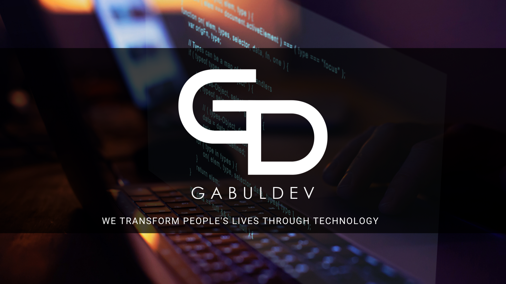

Hey there 👋

I’m Braydon, a senior full-stack engineer, creative coder and self-proclaimed designer who specializes in front-end development. I make it my mission to translate user-focused designs into pixel-perfect websites or applications that run blazing fast.

Want to know more about me? [Check out my portfolio.](https://braydoncoyer.dev/)

## 📝 Latest Videos

 

<!-- BLOG-POST-LIST:START -->

<!-- BLOG-POST-LIST:END -->

 

## 📌 Pinned Repositories

 

 

 
 

## 💼 Skills

